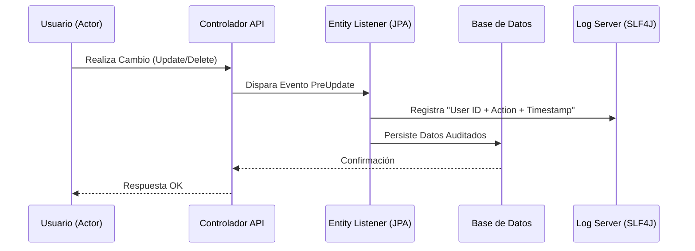

# 🔍 Especificación Técnica: Auditoría & Logs de Sistema
> **Versión**: 1.0.0 | **Módulo**: Core / Seguridad | **Tipo**: ECU (Especificación de Componentes)

---

## 1. Trazabilidad del Sistema
El ERP de Reyval implementa mecanismos de rastreo para asegurar que cada cambio crítico en la información (especialmente en entidades financieras y de clientes) pueda ser auditado.

## 2. Flujo de Auditoría (UML)

---

## 3. Especificaciones de Componente (ECU)

### [JPA Listeners]
- **ClienteListener**: Monitorea la creación de clientes para disparar automáticamente la creación de credenciales de acceso al portal.
- **AuditorAware**: El sistema utiliza `Spring Security` para capturar dinámicamente el nombre del usuario autenticado y estamparlo en los campos `creado_por` y `modificado_por` de las tablas principales.

### [Logs de Aplicación]
- **Nivel**: `INFO` para operaciones exitosas, `ERROR` para fallos de sistema.
- **Formato**: `[TIMESTAMP] [LEVEL] [USER_ID] [ENDPOINT] - [MESSAGE]`.
- **Retención**: Los logs se rotan diariamente y se mantienen por 30 días en el servidor.

---

## 4. Interfaz de Usuario (EIU) - Monitor de Actividad

El administrador puede visualizar la actividad a través de:

1.  **Bitácora de Eventos**: Lista cronológica de quién hizo qué.
2.  **Historial por Registro**: Dentro de cada Lote o Cliente, existe una pestaña de **[Auditoría]** que muestra la cronología de cambios de estatus.

> [!IMPORTANT]
> **Integridad**: Los registros de auditoría son de solo lectura. Ningún usuario, incluyendo el rol **[ADMIN]**, tiene permisos a través de la interfaz para modificar o eliminar entradas de la bitácora.

> [!TIP]
> **Depuración**: En caso de errores inesperados, los logs detallados permiten reconstruir la cadena de eventos que llevó al fallo, facilitando el soporte técnico.
