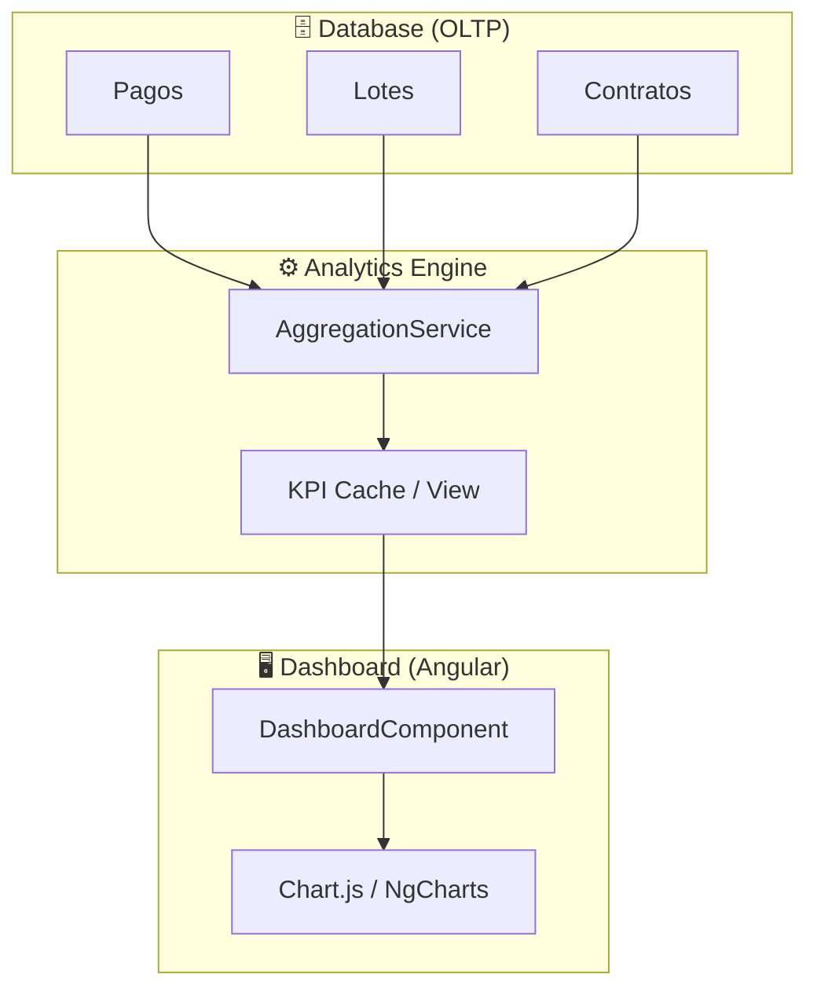
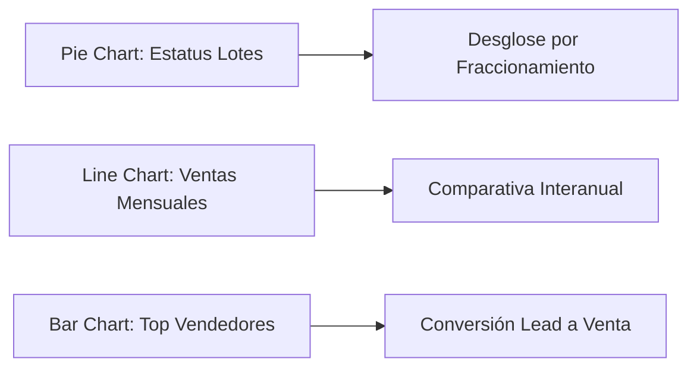

# 📊 Especificación Técnica — BI & Analytics (Dashboard)

> **Proyecto**: Reyval  
> **Módulos**: CU10 (BI & Reportes Estratégicos)  
> **Fecha**: 21 de Febrero, 2026

---

## 1. Arquitectura de Datos para Analítica

El módulo de BI (Business Intelligence) no consulta la base de datos transaccional directamente para cálculos complejos, sino que utiliza una **Capa de Agregación** para mejorar el rendimiento.



---

## 2. Definición de KPIs (Indicadores Clave)

El Dashboard principal muestra 4 métricas críticas para la toma de decisiones:

| KPI | Fórmula | Importancia |
|-----|---------|-------------|
| **Ventas Totales** | Suma de `valorOperacion` de contratos FIRMADOS. | Mide el crecimiento bruto del negocio. |
| **Recaudación Real** | Suma de `monto` de pagos VALIDADOS. | Flujo de caja efectivo (Cash-on-hand). |
| **Cartera Vencida** | Suma de cuotas PENDIENTES con fecha < NOW. | Mide el riesgo y eficiencia de cobranza. |
| **Disponibilidad** | (Lotes DISPONIBLES / Lotes Totales) * 100. | Mide el inventario remanente por fraccionamiento. |

---

## 3. Visualización Dinámica (Charts)

El sistema utiliza **Chart.js** para renderizar gráficos interactivos.



### Ejemplo de Estructura de Datos para Gráfico:
```json
{
  "labels": ["Enero", "Febrero", "Marzo"],
  "datasets": [
    { "label": "Ventas 2025", "data": [1200000, 1900000, 3000000] },
    { "label": "Ventas 2026", "data": [1500000, 2100000, 3800000] }
  ]
}
```

---

## 4. Exportación de Reportes

El módulo permite exportar los datos crudos detras de los KPIs en dos formatos:
1. **Excel (.xlsx)**: Para análisis manual por parte de contabilidad.
2. **PDF Ejecutivo**: Un resumen visual de los gráficos para juntas directivas.

---

## 5. Filtros Globales de Analítica

> [!TIP]
> Todos los KPIs pueden ser filtrados por:
> - **Fraccionamiento**: Para comparar el rendimiento de diferentes desarrollos.
> - **Rango de Fechas**: Para análisis estacionales (anual, mensual, semanal).
> - **Vendedor**: Para evaluar el desempeño del equipo comercial.

---

## 6. Seguridad en Reportes

- **Acceso Restringido**: Solo usuarios con `ROLE_ADMIN` o `ROLE_MANAGER` pueden acceder a la sección de BI completa.
- **Data Masking**: En reportes compartidos, se ocultan datos personales de los clientes (solo se muestran IDs y montos).
