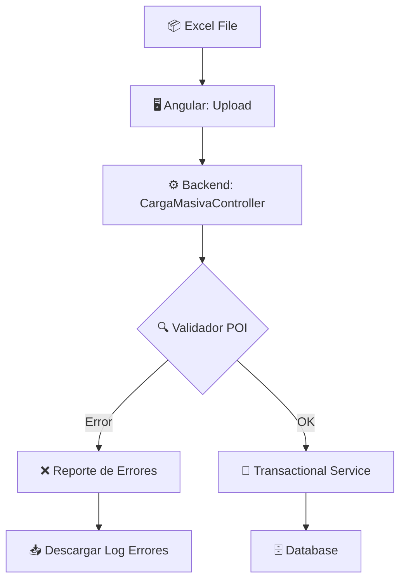
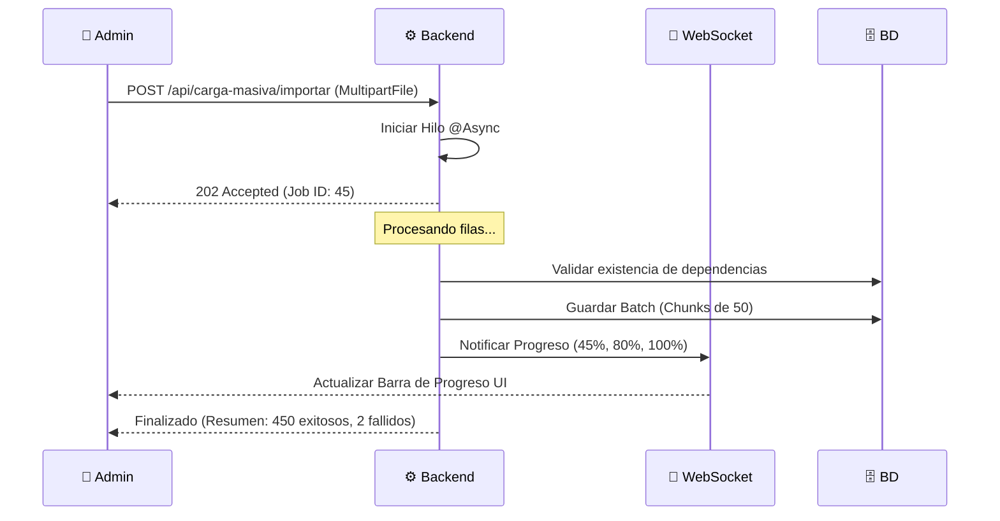

# 📥 Especificación Técnica — Carga Masiva (Batch Processing)

> **Proyecto**: Reyval  
> **Móduos**: CU07 (Carga Masiva / Excel)  
> **Fecha**: 21 de Febrero, 2026

---

## 1. Arquitectura de Procesamiento Batch

El módulo de carga masiva permite importar cientos de registros (Lotes, Clientes, Pagos) mediante archivos Excel (.xlsx), garantizando la integridad de los datos.



### 1.1 Librería: Apache POI
Se utiliza **Apache POI** para la lectura de streams de Excel. El sistema procesa celda por celda, validando tipos de datos y restricciones de base de datos antes de intentar persistir.

---

## 2. Diagrama de Secuencia: Flujo de Importación Asíncrona



---

## 3. Reglas de Validación Críticas

Para asegurar la calidad de la información, el validador aplica las siguientes reglas por tipo de objeto:

| Objeto | Validación |
|--------|------------|
| **Lotes** | Número de lote único por Fraccionamiento. Precio > 0. |
| **Clientes** | Email con formato válido. RFC único. |
| **Pagos** | La referencia debe existir en la Tabla de Amortización. |
| **General** | No debe haber campos obligatorios vacíos (Not Null). |

---

## 4. Gestión de Transacciones (Rollback Strategy)

> [!IMPORTANT]
> El sistema utiliza una estrategia de **"Atomicidad por Lote"**. Si falla una fila crítica, se puede configurar para hacer rollback de todo el archivo o solo omitir la fila errónea y generar un reporte de fallos. Por defecto, se prefiere la importación parcial con reporte de errores para no bloquear el trabajo del usuario.

---

## 5. El Reporte de Errores (Error Mapping)

Si una importación falla, el sistema devuelve un objeto JSON con el detalle:
```json
{
  "jobId": 45,
  "status": "COMPLETED_WITH_ERRORS",
  "errors": [
    {"fila": 12, "columna": "B", "mensaje": "El RFC ya existe en la base de datos"},
    {"fila": 15, "columna": "E", "mensaje": "Formato de fecha inválido"}
  ]
}
```

---

## 6. Recomendaciones de Escalabilidad

- **Streaming Reader**: Para archivos de >10,000 filas, usar `SXSSFWorkbook` (Sstreaming version) para evitar errores de `OutOfMemory`.
- **Background Jobs**: Implementar una cola de prioridad si hay múltiples usuarios cargando archivos pesados simultáneamente.
