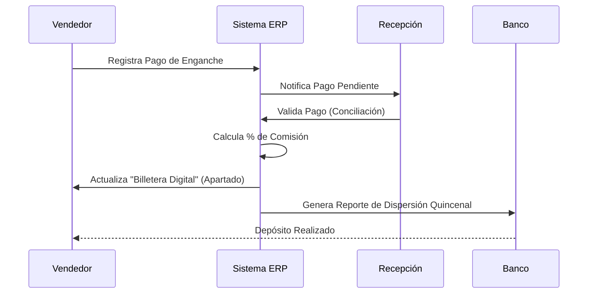

# 💸 Especificación Técnica: Comisiones de Vendedores
> **Versión**: 1.0.0 | **Módulo**: Comercial | **Tipo**: ECU (Especificación de Componentes)

---

## 1. Reglas de Cálculo de Comisiones
El sistema automatiza el cálculo de incentivos basados en el valor total de la venta y el esquema asignado al vendedor al momento de la firma.

### Estructura de Comisión Estándar:
| Componente | Porcentaje | Condición de Dispersión |
| :--- | :--- | :--- |
| **Comisión Vendedor** | 3.0% - 5.0% | Al validar el Pago de Enganche |
| **Bono de Cierre** | Fijo ($2,500) | Al firmar Contrato Físico |
| **Incentivo de Pago Adelantado** | 1.0% | Si el cliente paga > 10% adicional |

## 2. Flujo de Dispersión (UML)

---

## 3. Especificaciones de Componente (ECU)

### [Motor de Cálculo]
- **Entradas**: `CONTRATO_TOTAL`, `TIPO_VENDEDOR`, `VALOR_PUNTO`.
- **Lógica**: La comisión se calcula sobre el precio de lista original, sin incluir intereses bancarios posteriores.
- **Penalizaciones**: Si un contrato se cancela antes de 6 meses, la comisión pendiente se revierte automáticamente.

---

## 4. Interfaz de Usuario (EIU) - Mi Billetera (Vendedor)

El vendedor puede dar seguimiento a sus ingresos de forma transparente:

*   **Tablero de Totales**:
    - **Total Ganado**: Histórico acumulado.
    - **Por Cobrar**: Pagos ya validados en espera de dispersión.
    - **En Proceso**: Ventas con apartado pero sin enganche completo.

> [!IMPORTANT]
> **Bloqueo por Cartera**: Si el 10% de la cartera de un vendedor entra en estatus **[ROJO]** (más de 60 días de retraso), el sistema bloquea nuevas dispersiones de comisiones hasta que se regularice la cobranza de sus clientes.

> [!NOTE]
> Las comisiones se dispersan únicamente los días **15 y 30** de cada mes. El corte se realiza 2 días antes de la fecha de pago.
