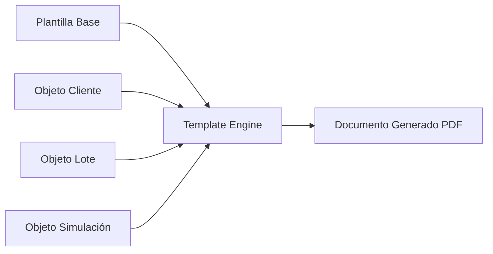
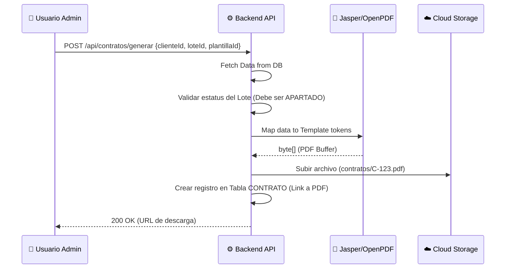
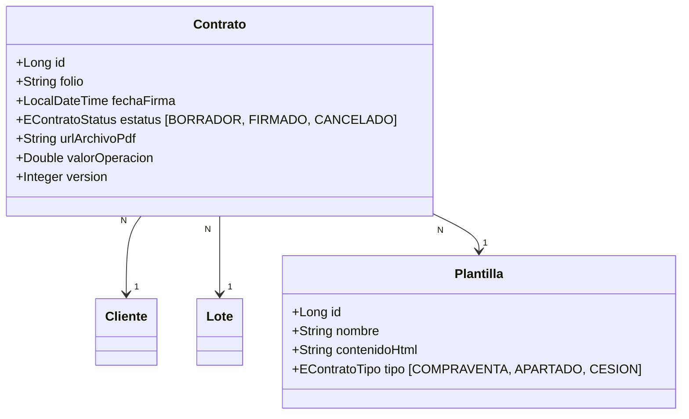

# ⚖️ Especificación Técnica — Contratación Legal

> **Proyecto**: Reyval  
> **Módulos**: CU06 (Contratos / Plantillas)  
> **Fecha**: 21 de Febrero, 2026

---

## 1. El Motor de Plantillas Dinámicas

El sistema genera contratos legales inyectando datos del mundo Java (Entidades) en plantillas predefinidas.

### 1.1 El Proceso de "Tokenización"
Las plantillas (en formato .docx o HTML) contienen tokens como `${cliente.nombre}` o `${lote.precio}`. El backend utiliza una librería (ej. **Thymeleaf** o **Apache Velocity**) para sustituir estos valores.

---

## 2. Diagrama de Secuencia: Generación de Contrato

---

## 3. Modelo de Datos del Contrato

---

## 4. Workflow de Firma y Formalización

1. **Borrador**: El sistema genera la primera versión. El vendedor revisa errores.
2. **Revisión**: Se pueden hacer ajustes manuales (edición de tokens).
3. **Formalizado**: Se marca como "FIRMADO". El Lote cambia automáticamente a estatus **VENDIDO**.
4. **Resguardo**: El PDF se vincula perpetuamente al Dossier del Cliente.

---

## 5. Auditoría Legal

> [!CAUTION]
> Para garantizar la integridad legal, cada contrato generado tiene un **Hash SHA-256** único almacenado en base de datos. Si el archivo es modificado fuera del sistema, el hash no coincidirá, alertando sobre una posible alteración del documento.

---

## 6. Futuras Integraciones

- [ ] **Firma Digital (eFirma)**: Integración con proveedores como DocuSign o HelloSign.
- [ ] **Notario Digital**: Envío automático de copias a carpetas compartidas con notarías externas.
