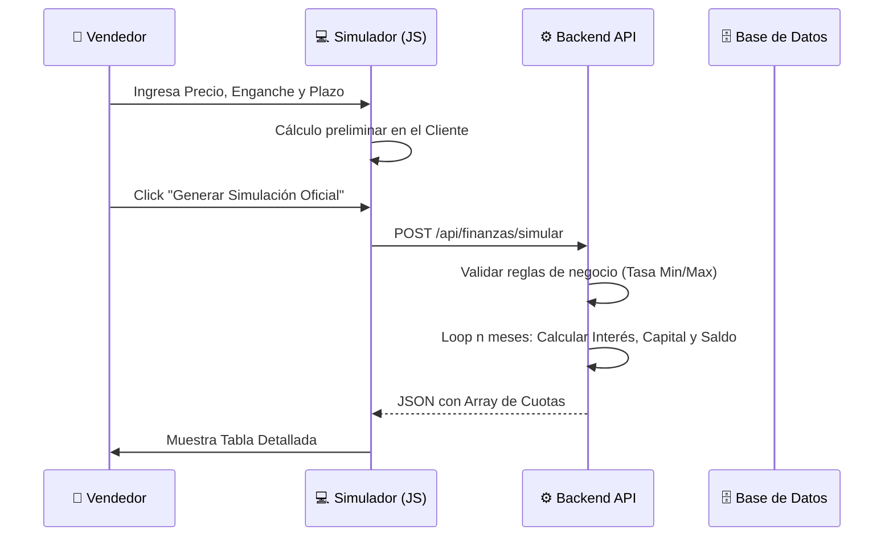
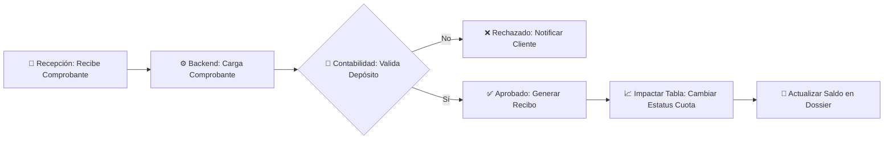

# 💰 Especificación Técnica — Finanzas & Simulación

> **Proyecto**: Reyval  
> **Módulos**: CU05 (Simulador), CU09 (Cobranza)  
> **Fecha**: 21 de Febrero, 2026

---

## 1. El Motor de Simulación (Cálculo Financiero)

El simulador permite al vendedor proyectar planes de pago personalizados basados en el precio del lote y las condiciones comerciales vigentes.

### 1.1 Fórmulas de Cálculo
El sistema soporta principalmente el **Sistema de Amortización Francés** (cuotas constantes):

$$ Cuota = P \times \frac{i(1+i)^n}{(1+i)^n - 1} $$

Donde:
- **P**: Principal (Precio Lote - Enganche).
- **i**: Tasa de interés mensual (Tasa Anual / 12).
- **n**: Número de meses (Plazo).

---

## 2. Diagrama de Secuencia: Generación de Tabla de Amortización

---

## 3. Estructura de la Tabla de Amortización

El objeto `Cuota` en el backend debe contener:

| Atributo | Descripción |
|----------|-------------|
| `numeroPago` | Índice del pago (1 a n). |
| `fechaVencimiento` | Fecha estimada de cobro. |
| `montoMensual` | Pago total bruto. |
| `interes` | Porción que va a intereses. |
| `capital` | Porción que reduce la deuda. |
| `saldoPendiente` | Capital restante después del pago. |
| `estatus` | [PENDIENTE, PAGADO, VENCIDO]. |

---

## 4. Workflow de Validación de Pagos

---

## 5. Integración con Contratación

> [!IMPORTANT]
> Una vez que el cliente acepta la simulación, se genera un **ID de Simulación**. Este ID es el que vincula el contrato legal con el plan de pagos real, asegurando que lo firmado coincida exactamente con lo calculado.

---

## 6. Reportes Financieros (BI)

El sistema agrega los datos de todas las tablas de amortización para generar:
- **Cashflow Proyectado**: Cuánto dinero entrará por mes basado en vencimientos.
- **Índice de Morosidad**: Porcentaje de cuotas vencidas vs. totales.
- **Ventas por Vendedor**: Basado en el valor de los contratos cerrados.
