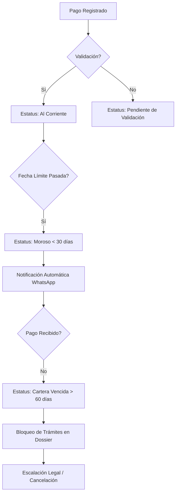

# 📉 Especificación Técnica: Gestión de Cartera & Cobranza
> **Versión**: 1.0.0 | **Módulo**: Finanzas | **Tipo**: ECU (Especificación de Componentes)

---

## 1. Objetivos del Proceso
Asegurar el flujo de caja del proyecto mediante la identificación proactiva de morosidad y la automatización de recordatorios de pago para evitar la descapitalización de los fraccionamientos.

## 2. Flujo de Estados de Cartera (UML)

## 3. Especificaciones de Componente (ECU)

### [Motor de Notificaciones]
- **Trigger**: Se ejecuta diariamente a las 08:00 AM.
- **Acción**: Escanea contratos con mensualidades vencidas cuya fecha de último pago sea mayor a `DIAS_TOLERANCIA` (Configurable por fraccionamiento).
- **Integración**: Consume el `MensajeService` para enviar recordatorios personalizados.

### [Bloqueo de Dossier]
- **Lógica**: Si un contrato tiene `MOROSIDAD_MESES >= 2`, el sistema inhabilita dinámicamente el botón de **[Descargar PDF Contrato]** y **[Solicitar Escrituración]** en el portal del cliente.

---

## 4. Interfaz de Usuario (EIU) - Dashboard de Cobranza

El administrador de cobranza utiliza una vista de "Heatmap" para priorizar llamadas:

- **Semáforo Financiero**:
    - 🟢 **Verde**: Menos de 5 días de retraso.
    - 🟡 **Amarillo**: 5 a 30 días de retraso.
    - 🔴 **Rojo**: Más de 30 días o Cartera Vencida.

### Acciones Premium:
- **[Botón WhatsApp Directo]**: Abre una ventana de chat con un template predefinido que incluye el Saldo Pendiente y la Cuenta CLABE del cliente.
- **[Generar Estado de Cuenta PDF]**: Crea un desglose detallado de capital vs interés moratorio para enviar por email.

> [!CAUTION]
> **Interés Moratorio**: El sistema aplica automáticamente un 3% (configurable) sobre el saldo vencido. Este cobro solo puede ser condonado por un usuario con rol **[ADMIN]**.

> [!TIP]
> **Proactividad**: El sistema envía un recordatorio 3 días antes de la fecha de vencimiento para incentivar el pago puntual.
