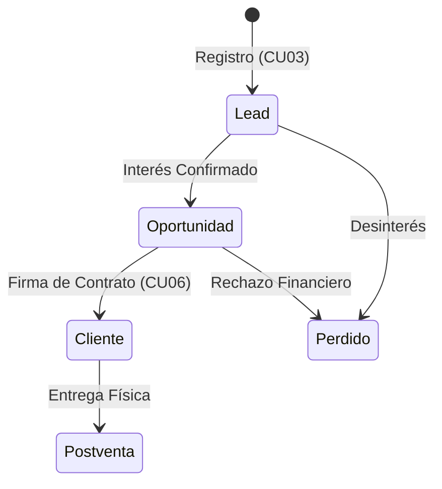
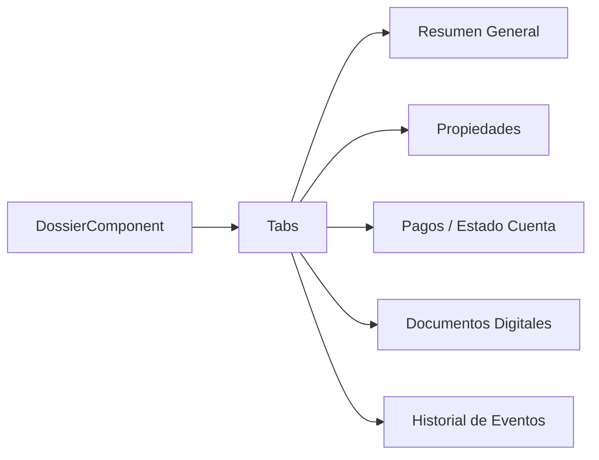

# 👥 Especificación Técnica — Gestión de Clientes Avanzada

> **Proyecto**: Reyval  
> **Módulos**: CRM / Dossier / Clientes  
> **Fecha**: 21 de Febrero, 2026

---

## 1. Ciclo de Vida del Prospecto (Lead to Client)

El éxito del ERP reside en la trazabilidad desde que un contacto llega por WhatsApp hasta que firma su contrato.



### 1.1 El Objeto "Dossier"
El Dossier es la vista unificada del cliente que integra:
- **Datos Personales**: KYC (Identificación, comprobantes).
- **Propiedades**: Lotes adquiridos y su estatus.
- **Finanzas**: Pagos realizados vs. Pendientes.
- **Historial**: Log de interacciones (Comunicaciones WA/Email).

---

## 2. Arquitectura del Dossier (Frontend)

El Dossier usa un componente de **Tabbed Navigation** para organizar la información sin abrumar al usuario.



---

## 3. Seguridad y Privacidad (RBAC)

Dado que se maneja información sensible (RFC, CURP, Teléfonos), el acceso al Dossier está restringido:

| Rol | Permiso |
|-----|---------|
| **Vendedor** | Solo clientes asignados a su cartera. |
| **Recepción** | Consulta de saldos y carga de comprobantes de pago. |
| **Admin** | Acceso total y capacidad de reasignar clientes. |
| **Contabilidad** | Validación de documentos fiscales. |

---

## 4. Auditoría de Cambios

Cada vez que un dato crítico del cliente (nombre, teléfono, precio acordado) cambia, el sistema registra una entrada en la tabla de auditoría:

```sql
-- Estructura simplificada de log
INSERT INTO AUDITORIA_CLIENTE (cliente_id, campo, valor_anterior, valor_nuevo, fecha, user_id)
VALUES (456, 'telefono', '555-1234', '555-9999', CURRENT_TIMESTAMP, 1);
```

---

## 5. Integración con otros Servicios

- **Notificaciones**: Al cambiar el estatus a "CLIENTE", se dispara un email de bienvenida automático.
- **Contratación**: Los datos del cliente se inyectan automáticamente en las plantillas PDF de los contratos.

---

## 6. Recomendaciones Técnicas

> [!TIP]
> Implementar un sistema de **"Carga de Archivos"** (Cloud Storage / S3) para los documentos del Dossier, evitando saturar la base de datos con archivos binarios (PDFs/Imágenes) y usando solo referencias de URL en el campo `adjunto`.
