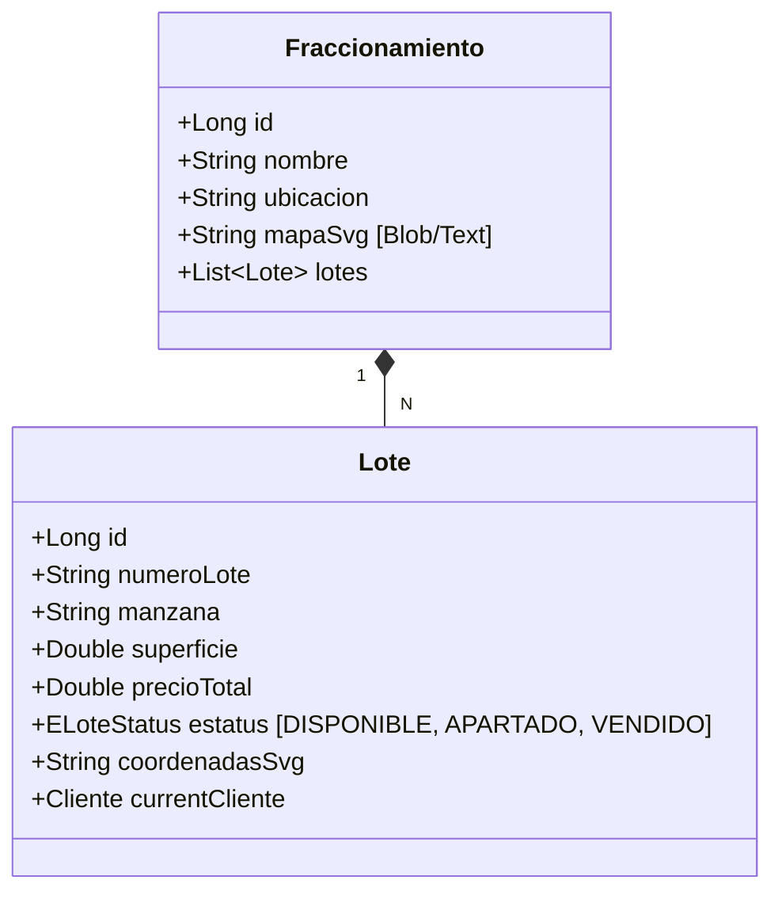

# 🏗️ Especificación Técnica — Inventario & Fraccionamientos

> **Proyecto**: Reyval  
> **Módulos**: CU01 (Gestión de Fraccionamientos), CU02 (Control de Lotes)  
> **Fecha**: 21 de Febrero, 2026

---

## 1. Arquitectura de Visualización Geográfica (SVG Maps)

El sistema utiliza un motor de renderizado basado en **SVG dinámicos** para permitir la interacción visual con los lotes en tiempo real.

```mermaid
graph TD
    subgraph Frontend["🖥️ Angular Client"]
        M[MapComponent]
        E[EditorPoligonosComponent]
        S[SvgService]
        M --> S
        E --> S
    end

    subgraph Backend["⚙️ Spring Boot API"]
        C[LoteController]
        D[FraccionamientoController]
        R[LoteRepository]
        C --> R
    </div>

    subgraph Database["🗄️ H2 / JPA"]
        L[Lote Entity]
        F[Fraccionamiento Entity]
    end

    S -->|GET /api/lotes/fracionamiento/{id}| C
    C --> L
    D --> F
```

### 1.1 El Concepto del "Path" SVG
Cada lote se representa por un elemento `<path>` o `<polygon>` en el XML del mapa. El sistema vincula el atributo `id` o `data-lote-id` del SVG con el número de lote en la base de datos.

---

## 2. Modelo de Datos (Dominio)

La relación entre fraccionamientos y lotes es de 1:N.



---

## 3. Flujo de Estados del Lote

El estado del lote es crítico para el motor de ventas y la visualización en el mapa.

| Estado | Color en Mapa | Regla de Negocio |
|--------|---------------|------------------|
| **DISPONIBLE** | 🟢 Verde (#2ecc71) | Puede ser seleccionado para simulación y contrato. |
| **APARTADO** | 🟡 Amarillo (#f1c40f) | Bloqueado temporalmente (72h default). Requiere pago de apartado. |
| **VENDIDO** | 🔴 Rojo (#e74c3c) | Bloqueado permanentemente. Vinculado a un contrato activo. |

---

## 4. Algoritmo de Sincronización de Coordenadas

Cuando el administrador usa el **Editor de Polígonos**, el flujo es el siguiente:

1. **Carga**: Se carga el archivo SVG base del fraccionamiento.
2. **Interacción**: El usuario hace clic en los vértices para "dibujar" el área del lote sobre la imagen base.
3. **Serialización**: Los puntos (x,y) se convierten a una cadena de texto (formato `coordenadasSvg`).
4. **Persistencia**: Se guarda el lote con sus nuevas coordenadas en `/api/lotes/{id}`.

### Ejemplo de JSON de Lote:
```json
{
  "id": 101,
  "numeroLote": "15",
  "manzana": "A",
  "estatus": "DISPONIBLE",
  "coordenadasSvg": "M 10 10 L 50 10 L 50 50 L 10 50 Z"
}
```

---

## 5. Roadmap de Mejoras de Inventario

- [ ] **Visión Drone**: Capacidad de superponer el mapa SVG sobre una imagen satelital real.
- [ ] **Filtros Dinámicos**: Resaltar lotes por rango de precio o superficie directamente en el mapa.
- [ ] **Apartado Online**: Integración con pasarela de pagos para cambiar estatus de lotes automáticamente al recibir el depósito.

---

## 6. Consideraciones de Rendimiento

> [!IMPORTANT]
> Para fraccionamientos con más de 500 lotes, se recomienda el uso de **Lazy Loading** para los datos de los lotes y optimización del DOM SVG para evitar lag en dispositivos móviles.
