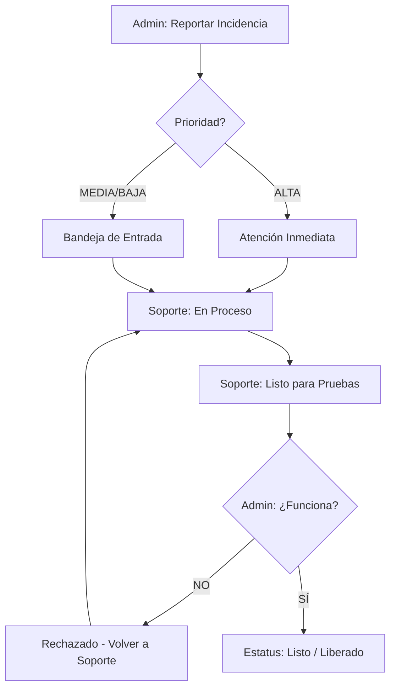

# 🛠️ Especificación Técnica: Módulo de Soporte Técnico
> **Versión**: 1.0.0 | **Módulo**: Administración / Mantenimiento | **Tipo**: ECU (Especificación de Componentes)

---

## 1. Objetivo del Módulo
Proporcionar un canal centralizado y trazable para el reporte de errores, incidencias técnicas y solicitudes de cambio, asegurando una comunicación fluida entre la operación (Admin) y el equipo de desarrollo/soporte.

## 2. Flujo de Gestión de Incidencias (UML)

---

## 3. Especificaciones de Componente (ECU)

### [Entidad Ticket]
- **Atributos Críticos**: `id`, `titulo`, `descripcion`, `prioridad` (Enum: BAJA, MEDIA, ALTA), `estatus` (Enum: ABIERTO, EN_PROCESO, LISTO_PARA_PRUEBAS, LISTO, LIBERADO, RECHAZADO).
- **Evidencia**: Almacenamiento binario (`@Lob`) para capturas de pantalla integradas en la base de datos para máxima portabilidad.
- **Bitácora**: Campo `comentarios` tipo texto largo que concatena las respuestas de ambos roles con autoría y timestamp.

### [Endpoints de Soporte]
- **POST `/api/tickets`**: Creación con soporte nativo para `multipart/form-data` (Envío de imagen).
- **PUT `/api/tickets/{id}/status`**: Cambio controlado de estados según el rol del usuario.
- **POST `/api/tickets/{id}/comentario`**: Adición de notas a la bitácora sin sobrescribir historial previo.

---

## 4. Interfaz de Usuario (EIU) - Centro de Soporte

El diseño utiliza una arquitectura de **Vista Dual** adaptativa:

### Para el Administrador (Reportante):
- **Botón [Reportar Incidencia]**: Abre un modal premium con validación de campos obligatorios.
- **Filtro "Mis Tickets"**: Vista simplificada para seguimiento de sus propios reportes.

### Para el Especialista de Soporte (Gestor):
- **Dashboard Global**: Acceso a la cola completa de incidencias de todos los desarrollos.
- **Panel de Conversación**: Interfaz tipo chat/bitácora para dar feedback técnico en tiempo real.

> [!IMPORTANT]
> **Prioridad Alta**: Los tickets con prioridad **ALTA** se marcan visualmente con un pulsante rojo en el dashboard para incentivar el cumplimiento de SLAs internos.

> [!NOTE]
> Para máxima eficiencia, se recomienda subir capturas de pantalla donde se observe claramente la URL y el mensaje de error del sistema.
