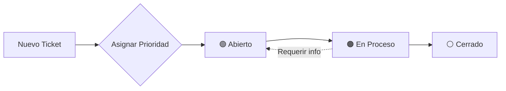

# 🎫 Especificación Técnica — Tickets de Soporte Técnico

> **Proyecto**: Reyval ERP  
> **Móduo**: CU12 (Soporte & Helpdesk)  
> **Fecha**: 23 de Febrero, 2026

---

## 1. Alcance
El módulo de soporte permite la comunicación asíncrona entre los usuarios (Vendedores, Recepción, Clientes) y el equipo de administración técnica para reportar incidencias, solicitar ajustes de datos o reportar bugs del sistema.

## 2. Flujo de Mensajes (ECU)
1. **Creación**: El usuario selecciona "Nuevo Ticket" y elige una categoría (Facturación, Inventario, Error de Sistema).
2. **Priorización**: El sistema asigna automáticamente una prioridad (Baja, Media, Alta) basada en la categoría.
3. **Asignación**: El ticket se notifica al Administrador en el panel "OC Master".
4. **Resolución**: El técnico responde y cambia el estado a "Resuelto" o "Cerrado".

## 3. Interfaz de Usuario (EIU)
- **Vista de Lista**: Tabla con ID, Asunto, Creador, Fecha y un distintivo de color para el Estatus (🟢 Abierto, 🟠 En Proceso, ⚪ Cerrado).
- **Chat de Ticket**: Línea de tiempo vertical con burbujas de mensaje para el historial del soporte.

---

## 4. Requerimientos de Datos
- `id_ticket`: UUID único.
- `categoria`: Enum (INFRA, DATA, USER, BUG).
- `mensajes`: Array de objetos `{autor, fecha, texto}`.
