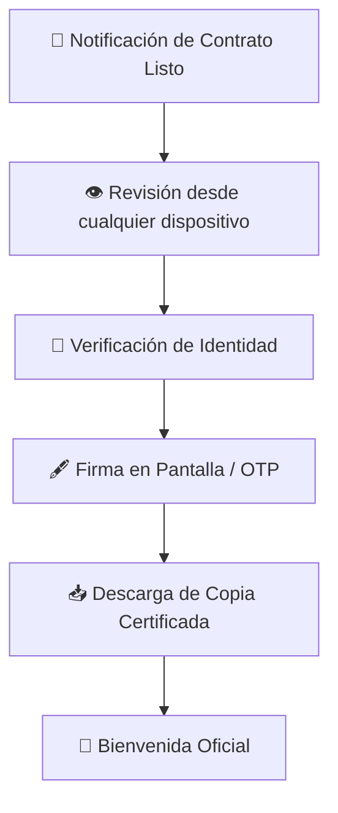
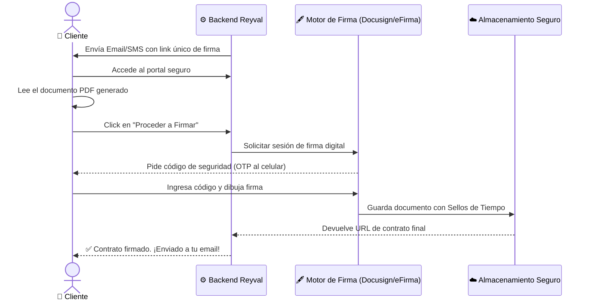

# ✍️ Experiencia del Cliente — Firma Digital de Contrato

> **Proyecto**: Reyval ERP  
> **Enfoque**: Cliente Final (Comprador)  
> **Propósito**: Modelar la formalización legal sin traslados físicos, centrada en la comodidad del cliente.

---

## 1. El Momento de la Firma

La firma del contrato es el hito emocional más alto. El sistema debe garantizar que este proceso sea solemne pero digitalmente sencillo.

---

## 2. Diagrama de Secuencia: "Firma desde Casa"

---

## 3. Valor Entregado al Cliente

| Característica | Beneficio para el Cliente |
|----------------|---------------------------|
| **Cero Desplazamientos** | Ahorro de tiempo y costos de traslado a oficina o notaría. |
| **Disponibilidad Permanente** | Puede leer el contrato a las 11 PM con calma desde su tablet. |
| **Seguridad Inviolable** | Certificado digital que garantiza que nadie alteró el contrato después de firmado. |

---

## 4. Certeza Jurídica para el Comprador

- **¿Qué validez tiene esto?**  
  El sistema utiliza la Ley de Firma Electrónica, con sellos de tiempo y constancias de conservación (NOM-151).
- **¿Qué pasa si me equivoco?**  
  Puedes rechazar el borrador y dejar un comentario para que el vendedor lo corrija antes de volver a enviarlo a firma.

---

> [!NOTE]
> **Toque Humano**: Una vez firmado, el sistema puede agendar automáticamente una llamada de bienvenida de parte de la dirección general.
