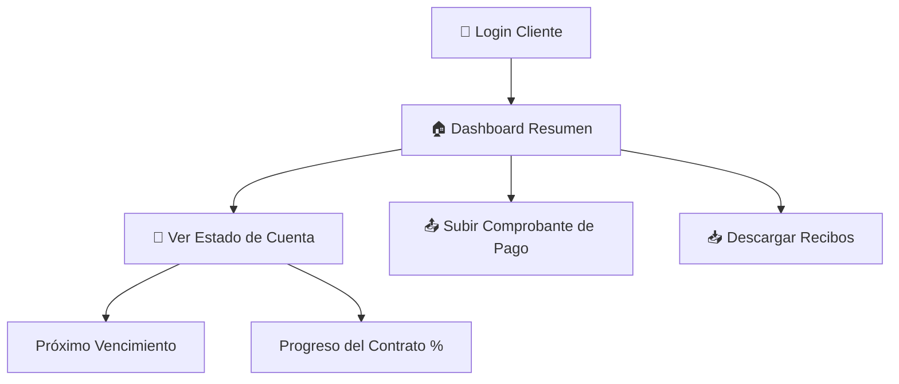
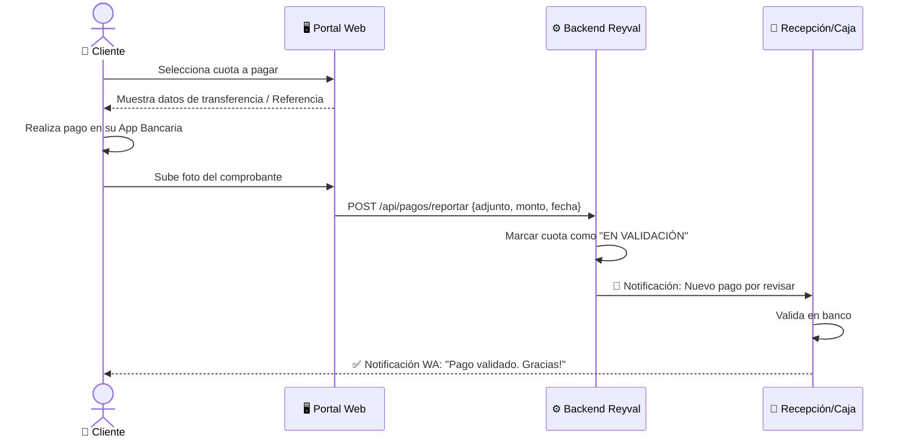

# 💳 Experiencia del Cliente — Portal de Pagos & Seguimiento

> **Proyecto**: Reyval ERP  
> **Enfoque**: Cliente Final (Comprador)  
> **Propósito**: Modelar cómo el cliente visualiza su estado de cuenta y gestiona sus pagos mensuales.

---

## 1. El Portal del Cliente (My Patrimony)

El cliente tiene acceso a una vista simplificada para monitorear su inversión. No ve la complejidad de contabilidad, solo lo que le importa: ¿Cuánto he pagado y cuánto me falta?

---

## 2. Flujo de Reporte de Pago (Self-Service)

El cliente no necesita llamar para avisar que pagó; lo hace directamente en el sistema.

---

## 3. Valor Entregado al Cliente

| Característica | Beneficio para el Cliente |
|----------------|---------------------------|
| **Estado de Cuenta 24/7** | Autonomía y tranquilidad. No depende de horarios de oficina. |
| **Buzón de Comprobantes** | Evita pérdida de tickets físicos o confusiones en WhatsApp. |
| **Barra de Progreso** | Motivación visual al ver cómo su deuda disminuye y su patrimonio crece. |

---

## 4. Escenario: "Mi pago no ha sido validado"

Si después de 48h el pago sigue "En Validación", el sistema ofrece un canal directo:
- **Botón de Soporte**: Abre un chat directo con el área de Caja con el ID de referencia ya cargado.
- **Historial de Comentarios**: El cliente puede ver por qué se rechazó (ej. "Comprobante ilegible").

---

> [!IMPORTANT]
> **Seguridad**: El cliente solo puede ver información de sus propios lotes y contratos mediante un filtrado estricto por `UserId` en el backend.
