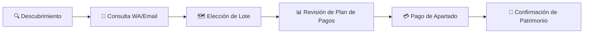
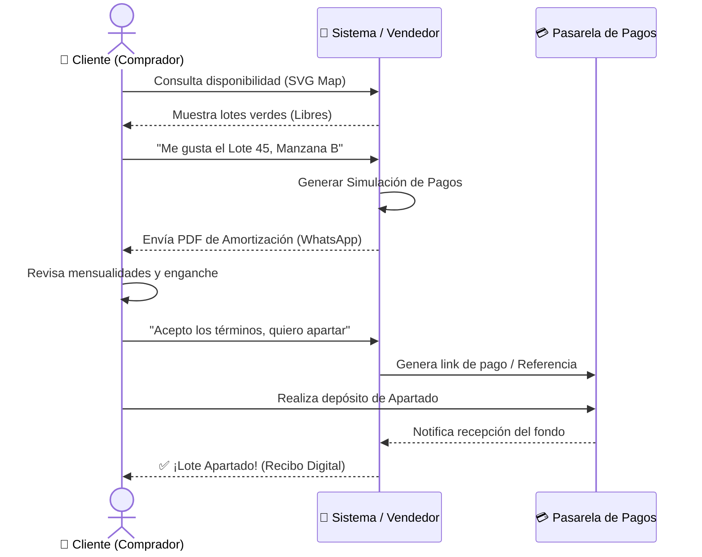

# 🎯 Experiencia del Cliente — Compra de Lote (Happy Path)

> **Proyecto**: Reyval ERP  
> **Enfoque**: Cliente Final (Comprador)  
> **Propósito**: Modelar el viaje del cliente desde el primer contacto hasta el apartado de su patrimonio.

---

## 1. El Viaje del Cliente (User Journey)

Para un comprador, el sistema debe ser transparente y ágil. Este diagrama muestra los hitos que el cliente percibe.

---

## 2. Diagrama de Secuencia: "Mi Primer Lote"

Este modelo UML muestra qué sucede desde el punto de vista del **Cliente** al interactuar con el ecosistema Reyval.

---

## 3. Valor Entregado al Cliente

Lo que el cliente obtiene en cada etapa:

| Etapa | Valor Tangible | Sensación del Cliente |
|-------|----------------|-----------------------|
| **Mapa Interactivo** | Certeza de ubicación. | "Sé exactamente qué estoy comprando". |
| **Simulador** | Transparencia financiera. | "No hay letras chiquitas en mis pagos". |
| **Recibo Digital** | Seguridad jurídica inmediata. | "Mi inversión está protegida desde el minuto 1". |

---

## 4. Preguntas Frecuentes del Comprador (FAQ)

- **¿Cómo sé si un lote sigue disponible?**  
  El mapa en tiempo real muestra en color verde solo lo que puedes comprar hoy.
- **¿Puedo cambiar mi plan de pagos?**  
  Sí, el vendedor puede re-simular diferentes enganches y plazos hasta que te sientas cómodo.
- **¿Qué sigue después del apartado?**  
  Recibirás tu contrato digital para firma y se te asignará un acceso al portal de clientes para ver tu estado de cuenta.

---

> [!TIP]
> **Experiencia Premium**: Al completar el apartado, el sistema puede enviar un mensaje automático de felicitación: *"¡Felicidades [Nombre]! Has dado el primer paso para construir tu futuro en Reyval."*
