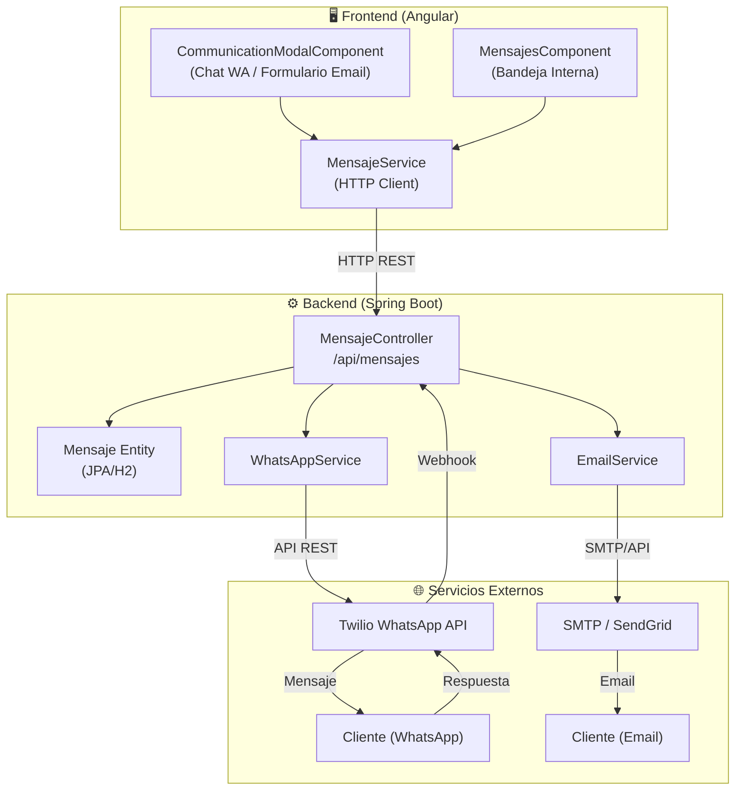
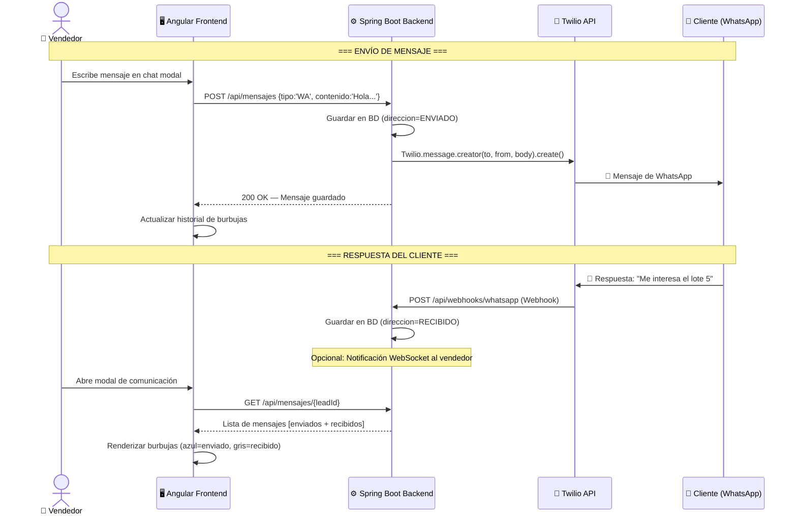
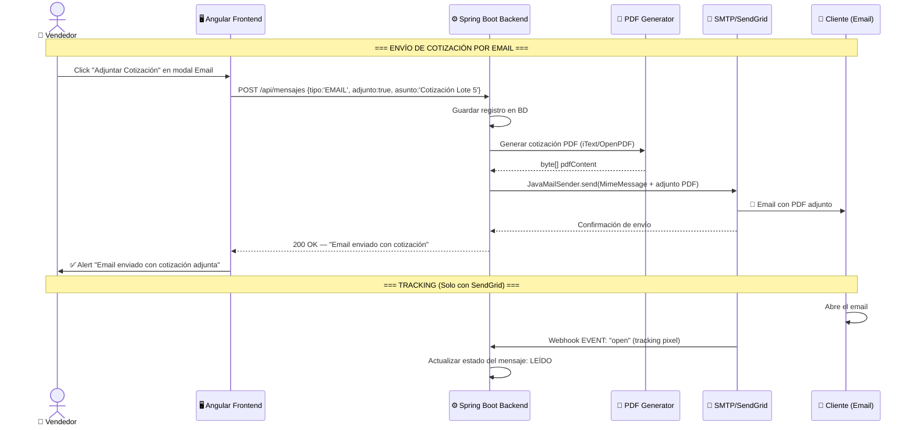
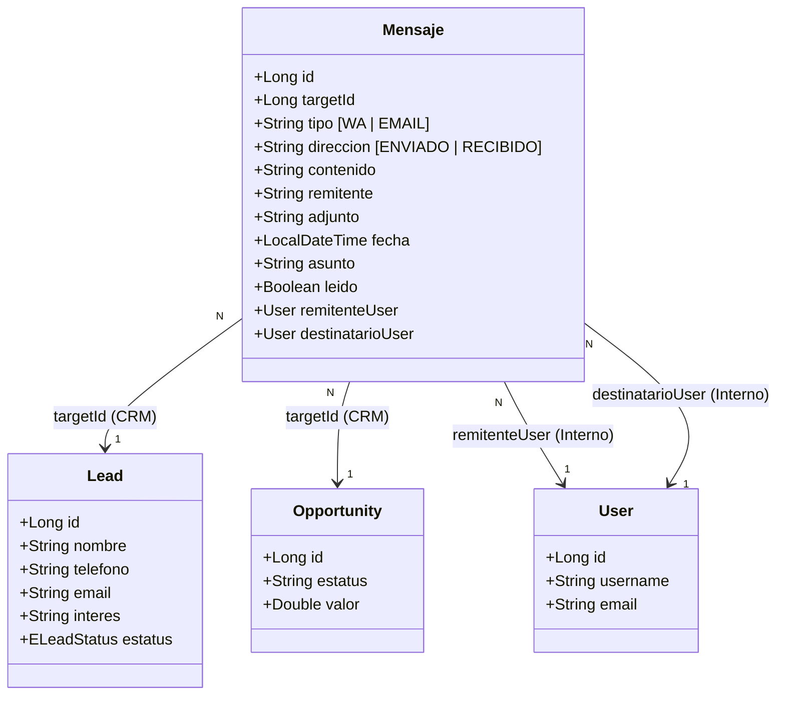
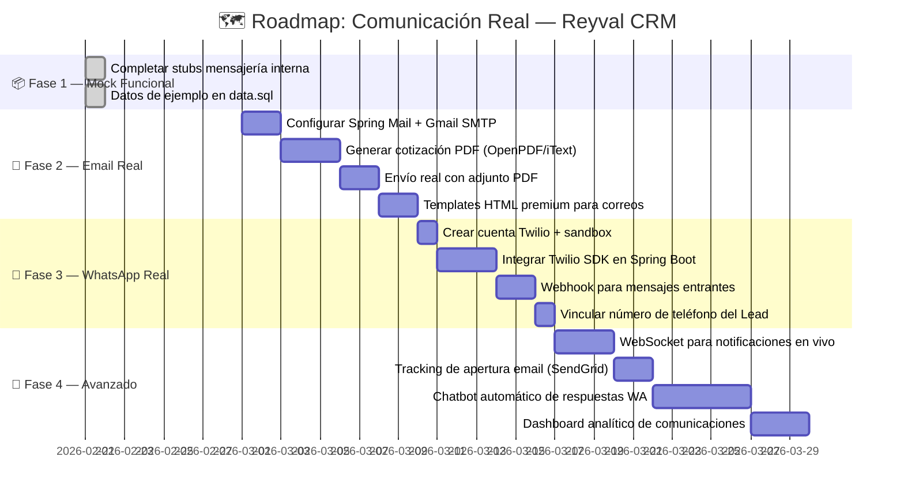
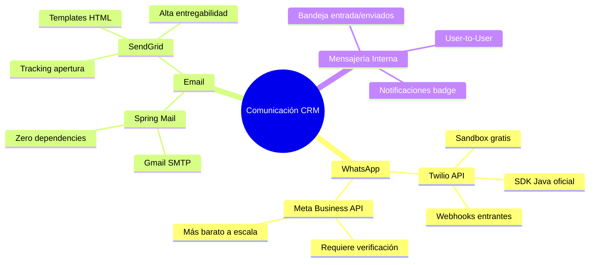

# 📡 Análisis de Tecnologías — Comunicación CRM (WhatsApp & Email)

> **Proyecto**: Reyval  
> **Fecha**: 21 de Febrero, 2026  
> **Propósito**: Documentar las opciones tecnológicas para integrar comunicación real por WhatsApp y Email desde el CRM inmobiliario.

---

## 1. Arquitectura General del Módulo de Comunicación



---

## 2. WhatsApp Business — Opciones Tecnológicas

### 2.1 Comparativa de Proveedores

| Proveedor | Costo por Mensaje | Costo Base | Complejidad | Sandbox Gratis | SDK Java |
|-----------|------------------|------------|-------------|----------------|----------|
| **Meta WhatsApp Business API** | ~$0.05-0.08 USD | Gratis (hosting propio) | 🔴 Alta | ❌ | ❌ (REST) |
| **Twilio WhatsApp** | ~$0.005 USD + fees | Pay-as-you-go | 🟡 Media | ✅ | ✅ |
| **360dialog** | Variable | Desde $49/mes | 🟡 Media | ✅ | ❌ (REST) |
| **WATI.io** | Incluido en plan | Desde $49/mes | 🟢 Baja | ✅ | ❌ (REST) |

### 2.2 Recomendación: **Twilio WhatsApp** ⭐

**¿Por qué Twilio?**
- SDK oficial para Java (`com.twilio.sdk`)
- Sandbox gratuito para desarrollo sin aprobación de Meta
- Escalable: misma cuenta sirve para SMS, voz y WhatsApp
- Webhooks nativos para mensajes entrantes
- Documentación excelente en español

### 2.3 Diagrama de Secuencia — Envío de WhatsApp Real



### 2.4 Código de Referencia — WhatsAppService.java (Futuro)

```java
@Service
public class WhatsAppService {

    @Value("${twilio.account-sid}")
    private String accountSid;

    @Value("${twilio.auth-token}")
    private String authToken;

    @Value("${twilio.whatsapp-number}")
    private String fromNumber;

    @PostConstruct
    public void init() {
        Twilio.init(accountSid, authToken);
    }

    /**
     * Envía un mensaje de WhatsApp real a través de Twilio.
     * @param toNumber Número del cliente con código de país (+52...)
     * @param body     Contenido del mensaje
     * @return SID del mensaje de Twilio para tracking
     */
    public String sendMessage(String toNumber, String body) {
        Message message = Message.creator(
            new PhoneNumber("whatsapp:" + toNumber),
            new PhoneNumber("whatsapp:" + fromNumber),
            body
        ).create();
        return message.getSid();
    }
}
```

### 2.5 Configuración Necesaria

```properties
# application.properties — Twilio WhatsApp
twilio.account-sid=ACxxxxxxxxxxxxxxxxxxxxxxxxxxxxxxxx
twilio.auth-token=xxxxxxxxxxxxxxxxxxxxxxxxxxxxxxxx
twilio.whatsapp-number=+14155238886

# Para sandbox de desarrollo:
# El cliente debe enviar "join <sandbox-keyword>" al +1 415 523 8886
```

---

## 3. Email — Opciones Tecnológicas

### 3.1 Comparativa de Proveedores

| Proveedor | Emails Gratis/Día | Costo Producción | Tracking | Adjuntos | Templates HTML |
|-----------|-------------------|------------------|----------|----------|----------------|
| **Spring Mail + Gmail** | 500/día | Gratis | ❌ | ✅ | Manual |
| **SendGrid** | 100/día | Desde $19.95/mes | ✅ Apertura + Click | ✅ | ✅ Dashboard |
| **Amazon SES** | 0 (62K gratis con EC2) | $0.10/1000 | ✅ con SNS | ✅ | Manual |
| **Mailgun** | ~1,667/mes (3 meses) | Desde $35/mes | ✅ | ✅ | ✅ |

### 3.2 Estrategia Recomendada: **Spring Mail → SendGrid** ⭐

| Fase | Tecnología | Razón |
|------|-----------|-------|
| **Desarrollo** | Spring Mail + Gmail SMTP | Zero config adicional, gratis, sin cuenta externa |
| **Producción** | SendGrid API | Tracking de apertura, plantillas HTML, alta entregabilidad |

### 3.3 Diagrama de Secuencia — Envío de Email con Cotización PDF



### 3.4 Código de Referencia — EmailService.java (Futuro)

```java
@Service
public class EmailService {

    @Autowired
    private JavaMailSender mailSender;

    /**
     * Envía un email con cotización PDF adjunta.
     * @param to      Email del destinatario
     * @param subject Asunto del correo
     * @param body    Cuerpo del mensaje
     * @param pdfData Bytes del PDF (nullable)
     */
    public void sendEmail(String to, String subject, String body, byte[] pdfData) 
            throws MessagingException {
        MimeMessage message = mailSender.createMimeMessage();
        MimeMessageHelper helper = new MimeMessageHelper(message, true, "UTF-8");
        
        helper.setTo(to);
        helper.setSubject(subject);
        helper.setText(body, true); // HTML enabled
        helper.setFrom("ventas@reyval.com");
        
        if (pdfData != null) {
            helper.addAttachment("Cotizacion_Reyval.pdf", 
                new ByteArrayResource(pdfData), "application/pdf");
        }
        
        mailSender.send(message);
    }
}
```

### 3.5 Configuración Necesaria

```properties
# === FASE 1: Gmail SMTP (Desarrollo) ===
spring.mail.host=smtp.gmail.com
spring.mail.port=587
spring.mail.username=ventas.reyval@gmail.com
spring.mail.password=xxxx-xxxx-xxxx-xxxx  # App Password de Google
spring.mail.properties.mail.smtp.auth=true
spring.mail.properties.mail.smtp.starttls.enable=true

# === FASE 2: SendGrid (Producción) ===
# spring.mail.host=smtp.sendgrid.net
# spring.mail.port=587
# spring.mail.username=apikey
# spring.mail.password=SG.xxxxxxxxxxxx  # API Key de SendGrid
```

---

## 4. Diagrama de Clases — Modelo de Datos



---

## 5. Roadmap de Implementación



---

## 6. Estimación de Costos Mensuales (Producción)

| Servicio | Plan | Costo Estimado |
|----------|------|----------------|
| Twilio WhatsApp | ~200 mensajes/mes | ~$5-10 USD |
| SendGrid Email | Free tier (100/día) | $0 USD |
| **TOTAL** | | **~$5-10 USD/mes** |

> [!TIP]
> Para un volumen bajo de mensajes (como una empresa inmobiliaria pequeña-mediana), el costo es mínimo. Twilio cobra por mensaje y SendGrid tiene un tier gratuito generoso.

---

## 7. Consideraciones de Seguridad

| Aspecto | Recomendación |
|---------|---------------|
| **API Keys** | Almacenar en variables de entorno, NUNCA en código |
| **Webhooks** | Validar firma de Twilio en cada request entrante |
| **GDPR/Privacidad** | Obtener consentimiento del cliente antes de enviar WA |
| **Rate Limiting** | Implementar throttling para evitar spam accidental |
| **Números telefónicos** | Almacenar con código de país (+52 para México) |

---

## 8. Resumen Ejecutivo



---

## 9. Aclaraciones Técnicas Adicionales

### 9.1 Historial de Mensajes (Enviados/Recibidos)
Es **totalmente viable** registrar tanto los mensajes que salen del CRM como los que el cliente nos envía.
*   **Envío:** El sistema guarda el registro en la tabla `mensajes` justo antes de enviarlo a la API (Twilio/SendGrid).
*   **Recepción:** Se configura un **Webhook** (punto 2.3) para que Twilio avise al sistema cada vez que el cliente responde, permitiendo guardar la respuesta automáticamente en el historial del Lead.

### 9.2 Envío de Archivos Multimedia (PDF)
Twilio soporta el envío de archivos adjuntos mediante una URL pública del archivo.
*   **Flujo sugerido:** El sistema genera el PDF de cotización -> Lo almacena temporalmente (ej. Amazon S3 o el mismo server) -> Envía la URL a Twilio -> El cliente recibe el **PDF directamente en su WhatsApp**.

> [!IMPORTANT]
> El sistema actual (`MensajeController` y entidad `Mensaje`) ya cuenta con los campos necesarios (`targetId`, `direccion`, `adjunto`) para soportar estas funcionalidades sin cambios estructurales en la base de datos.
